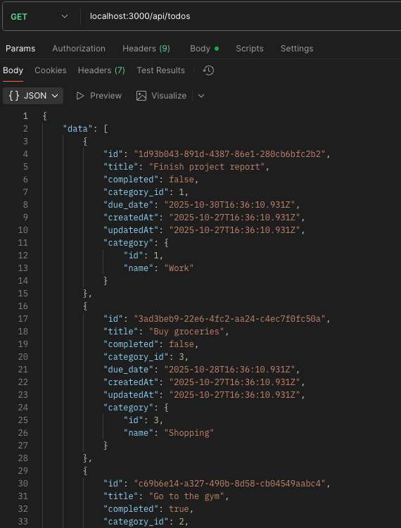
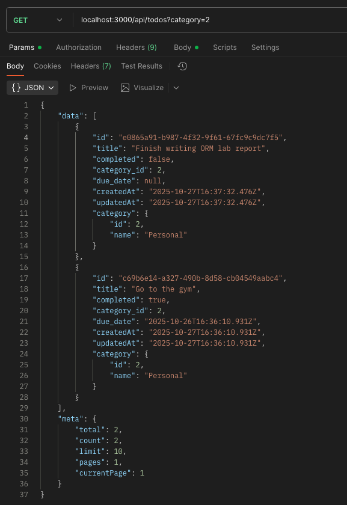
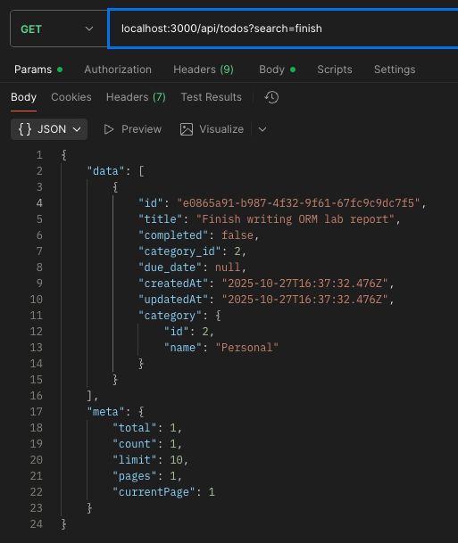
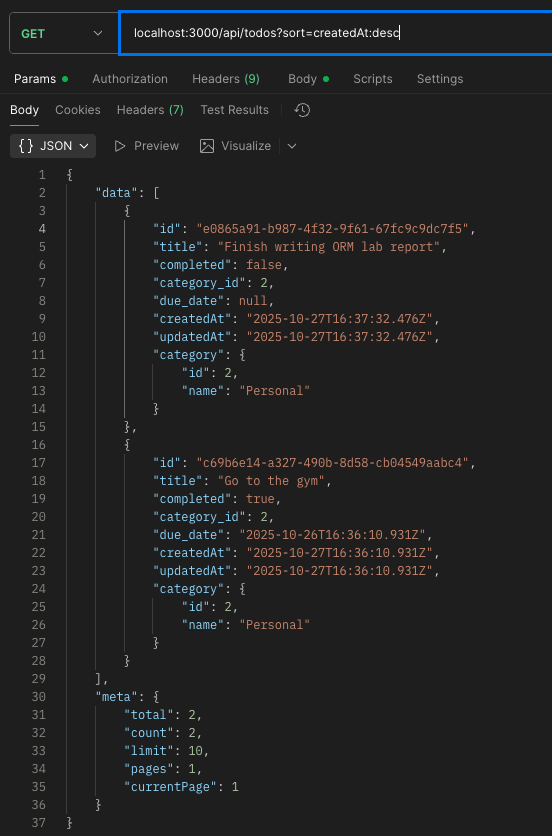
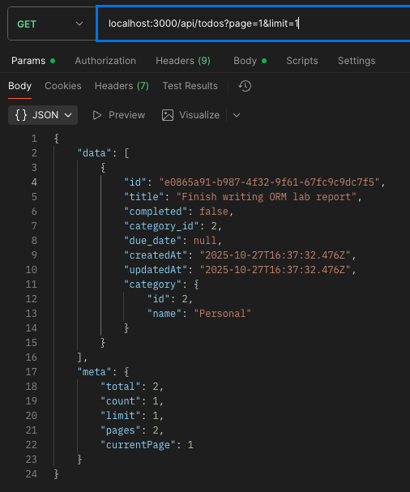
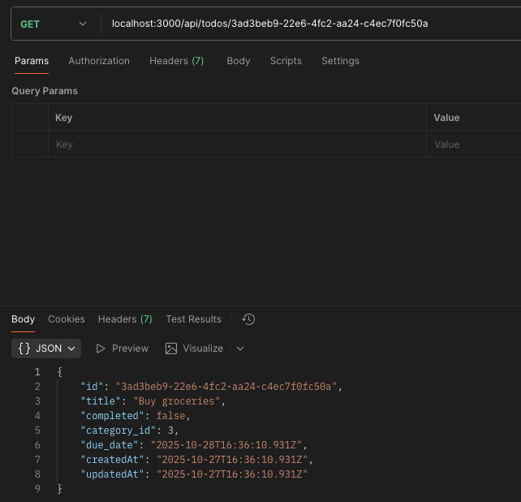
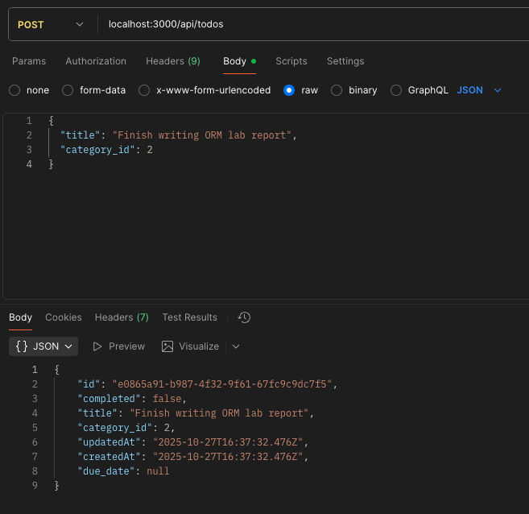
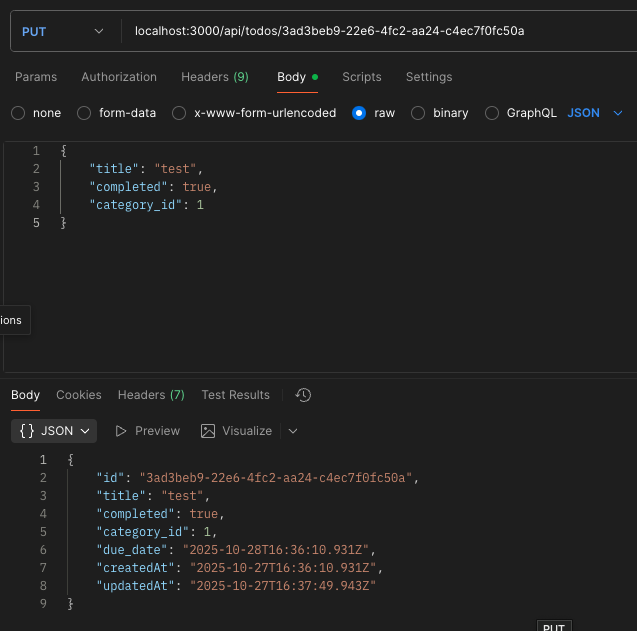
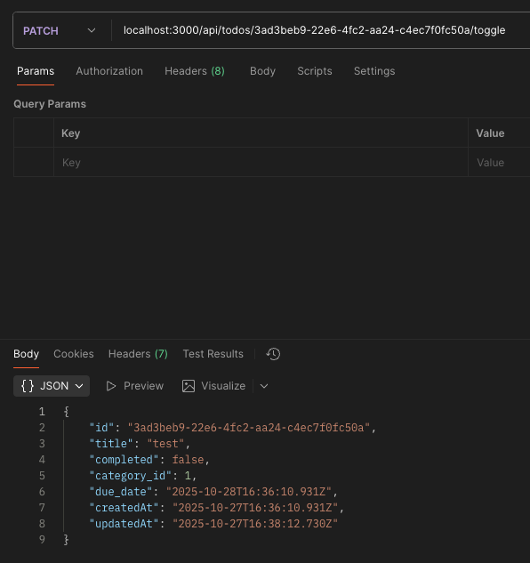
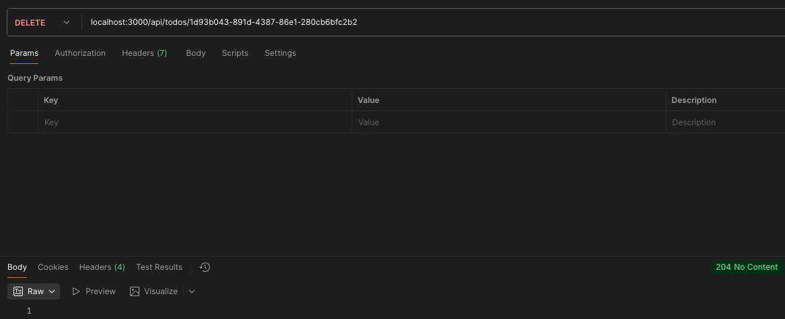

# Lab №2: Working with a Database

---

## 🎯 Objective

- Learn how to design and implement a **REST API** with multiple **related entities**.  
- Practice using **PostgreSQL** in a **Node.js + Express** application with either an **ORM**.
- Implement proper **CRUD operations**, as well as **filtering**, **sorting**, and **pagination**.  
- Understand and apply **one-to-many (1:N)** relationships in relational databases.

---

## 📘 Task Description

Develop a **Task Management Service (Todo List)** with the following features:

- View the list of tasks  
- Create a new task  
- Toggle the task status (completed / not completed)  
- Delete a task  
- Edit a task  
- Filter tasks by **categories**  
- Search tasks by **title**  
- Paginate the task list  

---

## 🧩 Entities

Project includes **two entities**:

### 1. `categories`
- Represents task categories.

### 2. `todos`
- Represents individual tasks.  
- Each task must belong to **one category**.

---

## 💡 Used Stack

- **Backend:** Node.js + Express  
- **Database:** PostgreSQL  
- **ORM:** Sequelize 
- **API Testing:** Postman 

---

## Installation and Project Launch Instructions

1. Install Node.js

    Make sure you have Node.js installed. Check your version:
   
```
    node -v
    npm -v
```

2. Clone or Download the Project

```
   git clone <repo-url>
   cd <your-project-folder>
```

3. Install Dependencies

```
    npm install
```

4. Run migrations

```
    npx sequelize-cli db:migrate
```

5. Start the server

```
    npm run dev
```

---

## Project's Structure

    node-toDo-app-db/
    ├── config/
    │   └── config.js                    # Database configuration for Sequelize
    │
    ├── controllers/
    │   ├── CategoriesController.js      # Handles category-related logic
    │   └── TodoController.js            # Handles todo-related logic
    │
    ├── migrations/
    │   ├── 20251026143524-create-category.js  # Migration for creating 'Category' table
    │   └── 20251026143745-create-todo.js      # Migration for creating 'Todo' table
    │
    ├── models/
    │   ├── category.js                  # Sequelize model for Category
    │   ├── todo.js                      # Sequelize model for Todo
    │   └── index.js                     # Model initialization and associations
    │
    ├── routes/
    │   ├── CategoryRoute.js             # Routes for categories
    │   ├── TodoRoute.js                 # Routes for todos
    │   └── swaggerDocs.js               # Swagger documentation routes
    │
    ├── seeders/
    │   ├── 20251026151718-demo-categories.js  # Seeds demo data for categories
    │   └── 20251026151800-demo-todos.js       # Seeds demo data for todos
    │
    ├── swagger/
    │   └── swagger.js                   # Swagger configuration for API docs
    │
    ├── .gitignore                       # Git ignore file
    ├── app.js                           # Main entry point of the application
    ├── example.env                      # Example environment configuration
    ├── package.json                     # Project metadata and dependencies
    ├── package-lock.json                # Dependency lock file
    └── README.md                        # Project documentation

---

## Example Usage

---

### Step 1 – Database 

1. Configure the database connection

Application uses `Sequelize` with environment-based configurations. The `config/config.js` file reads database credentials from the `.env` (example.env) file using `dotenv`.

```javascript
    development: {
    username: process.env.DB_USER,
    password: process.env.DB_PASSWORD,
    database: process.env.DB_NAME,
    host: process.env.DB_HOST,
    dialect: "postgres",
  }
```

- `dotenv` automatically loads variables from a `.env` file into `process.env`.
- This setup keeps sensitive information (like database passwords) out of the codebase.
- Can configure separate databases for different environments:
  - **development**
  - **test**
  - **production**

2. Migrations

The database has two tables: `Categories` and `Todos`.  
Migrations create the schema and seed initial data:

**Categories table creation (migration snippet):**

```javascript
    await queryInterface.createTable('Categories', {
    id: { type: Sequelize.INTEGER, primaryKey: true, autoIncrement: true },
    name: { type: Sequelize.STRING(100), allowNull: false },
    created_at: { type: Sequelize.DATE, allowNull: false },
    updated_at: { type: Sequelize.DATE, allowNull: false }
    });
```

**Todos table creation (migration snippet):**

```javascript
    await queryInterface.createTable('Todos', {
    id: { type: Sequelize.UUID, defaultValue: Sequelize.literal('gen_random_uuid()'), primaryKey: true },
    title: { type: Sequelize.TEXT, allowNull: false },
    completed: { type: Sequelize.BOOLEAN, defaultValue: false },
    category_id: {
        type: Sequelize.INTEGER,
        references: { model: 'Categories', key: 'id' },
        onUpdate: 'CASCADE',
        onDelete: 'CASCADE'
    },
    due_date: { type: Sequelize.DATE },
    created_at: { type: Sequelize.DATE, allowNull: false },
    updated_at: { type: Sequelize.DATE, allowNull: false }
    });
```

**Seeding initial categories:**

```javascript
    await queryInterface.bulkInsert('Categories', [
    { name: 'Work', created_at: new Date(), updated_at: new Date() },
    { name: 'Personal', created_at: new Date(), updated_at: new Date() },
    { name: 'Shopping', created_at: new Date(), updated_at: new Date() }
    ]);
```

**Seeding initial todos:**

```javascript
    await queryInterface.bulkInsert('Todos', [
    { title: 'Finish project report', completed: false, category_id: 1, due_date: new Date(), created_at: new Date(), updated_at: new Date() },
    { title: 'Buy groceries', completed: false, category_id: 3, due_date: new Date(), created_at: new Date(), updated_at: new Date() },
    { title: 'Go to the gym', completed: true, category_id: 2, due_date: new Date(), created_at: new Date(), updated_at: new Date() }
    ]);
```

---

### Step 2 - Models

The project uses Sequelize models to interact with the database.

**Category model:**

```javascript
import { Model, DataTypes } from 'sequelize';

export default (sequelize) => {
  class Category extends Model {
    static associate(models) {
      Category.hasMany(models.Todo, { foreignKey: 'category_id', as: 'todos' });
    }
  }
  Category.init({
    name: { type: DataTypes.STRING(100), allowNull: false }
  }, {
    sequelize,
    modelName: 'Category',
    tableName: 'Categories',
    underscored: true,
  });
  return Category;
};
```

**Todo model:**

```javascript
import { Model, DataTypes } from 'sequelize';

export default (sequelize) => {
  class Todo extends Model {
    static associate(models) {
      Todo.belongsTo(models.Category, { foreignKey: 'category_id', as: 'category' });
    }
  }
  Todo.init({
    id: { type: DataTypes.UUID, defaultValue: DataTypes.UUIDV4, primaryKey: true },
    title: { type: DataTypes.TEXT, allowNull: false },
    completed: { type: DataTypes.BOOLEAN, defaultValue: false },
    category_id: { type: DataTypes.INTEGER, allowNull: true },
    due_date: { type: DataTypes.DATE, allowNull: true }
  }, {
    sequelize,
    modelName: 'Todo',
    tableName: 'Todos',
    underscored: true,
  });
  return Todo;
};
```

**Database initialization (index.js snippet):**

```javascript
import Sequelize, { DataTypes } from 'sequelize';
import configLoader from '../config/config.js';

const env = process.env.NODE_ENV || 'development';
const config = configLoader[env];
const sequelize = new Sequelize(config.database, config.username, config.password, config);

const db = {};
// Dynamically import all models
for (const file of readdirSync(__dirname)) {
  if (file.endsWith('.js') && !file.includes('.test.js')) {
    const model = (await import(join(__dirname, file))).default(sequelize, DataTypes);
    db[model.name] = model;
  }
}

// Apply associations
Object.keys(db).forEach(modelName => {
  if (db[modelName].associate) db[modelName].associate(db);
});

db.sequelize = sequelize;
db.Sequelize = Sequelize;

export default db;
```

> **Note:** These snippets demonstrate how to:
> - Create the database tables (`Categories` and `Todos`) using migrations  
> - Seed initial data into both tables  
> - Define Sequelize models with proper associations  
> - Initialize Sequelize and dynamically load all models for use in the application

### Running Migrations and Seeds

Use the Sequelize CLI to manage your database:

- **Run all migrations:**  

```bash
npx sequelize-cli db:migrate
```

- **Undo all migrations:**

```bash
npx sequelize-cli db:migrate:undo:all
```

- **Run all seeders:**

```bash
npx sequelize-cli db:seed:all
```

- **Undo all seeders:**

```bash
npx sequelize-cli db:seed:undo:all
```

> For more details, see **2. Sequelize CLI Commands** in the [Useful Links](#useful-links) section – a complete guide to migrations, seeders, and more.

---

### Step 3 - API Implementation

The project provides a RESTful API to manage **Todos** and **Categories**.

### Categories API

| Method | URL                 | Description                  | Response Code |
|--------|---------------------|------------------------------|---------------|
| GET    | /api/categories     | Get all categories           | 200           |
| GET    | /api/categories/:id | Get category by ID           | 200 / 404     |
| POST   | /api/categories     | Create a new category (name) | 201           |
| PUT    | /api/categories/:id | Update category name         | 200 / 404     |
| DELETE | /api/categories/:id | Delete a category            | 204 / 404     |

---

### Todos API

| Method | URL                   | Description                                 | Response Code |
|--------|-----------------------|---------------------------------------------|---------------|
| GET    | /api/todos            | Get all todos                               | 200           |
| GET    | /api/todos/:id        | Get todo by ID                              | 200 / 404     |
| POST   | /api/todos            | Create a new todo (title, category_id)      | 201           |
| PUT    | /api/todos/:id        | Update todo (title, completed, category_id) | 200 / 404     |
| PATCH  | /api/todos/:id/toggle | Toggle todo completion status               | 200 / 404     |
| DELETE | /api/todos/:id        | Delete a todo                               | 204 / 404     |

---

### Todos Controller

The `TodoController` handles all operations for the `/api/todos` endpoint.

**Get all todos (with filtering, search, pagination, sorting):**

```javascript
const { count, rows } = await Todo.findAndCountAll({
    include: { model: Category, as: 'category', attributes: ['id', 'name'] },
    where,       // Filtering by category and search
    order,       // Sorting
    limit, offset // Pagination
});
```











**Get todo by ID:**

```javascript
const todo = await Todo.findByPk(req.params.id);
if (!todo) return res.status(404).json({ error: 'Task not found' });
```



**Create a new todo:**

```javascript
const newTodo = await Todo.create({ title, category_id });
res.status(201).json(newTodo);
```



**Update a todo:**

```javascript
todo.title = title ?? todo.title;
todo.completed = completed ?? todo.completed;
await todo.save();
```



**Toggle completion status:**

```javascript
todo.completed = !todo.completed;
await todo.save();
res.json(todo);
```



**Delete a todo:**

```javascript
await todo.destroy();
res.status(204).send();
```




> **Note:** The controller also handles errors and returns appropriate HTTP status codes (200, 201, 204, 404, 500).

> **Note:** The same business logic (CRUD operations, error handling, and HTTP status codes) is applied in the `CategoryController`.

---

## Control Questions?

1. What is a relational database, and what advantages does it provide?

A **relational database** is a collection of data points with pre-defined relationships between them. The relational model organizes data into tables — with each row representing an individual record and each column consisting of attributes that contain values. 

**Advantages:**
- Data integrity
- Security
- Backup and disaster recovery
- Community support

2. What types of relationships exist between tables in relational databases?

- `One-to-One (1:1)`: Each row in table A corresponds to one row in table B.
- `One-to-Many (1:N)`: A single row in table A can relate to multiple rows in table B.
- `Many-to-Many (M:N)`: Rows in table A can relate to multiple rows in table B, and vice versa, usually implemented with a reference table.

3. What is a RESTful API, and what is it used for?

REST API stands for Representational State Transfer API. It is a type of API (Application Programming Interface) that allows communication between different systems over the internet. REST APIs work by sending requests and receiving responses, typically in JSON format, between the client and server.

4. What is an SQL injection, and how can it be prevented?

SQL injection is a code injection technique that might destroy your database. SQL injection usually occurs when you ask a user for input, like their `username/userid`, and instead of a `name/id`, the user gives you an SQL statement that you will **unknowingly** run on your database. 

**Prevention:**
- Use parameterized queries or prepared statements.
- Use ORMs that automatically handle query escaping.
- Validate and sanitize user input.

5. What is the difference between an ORM and raw SQL queries? Advantages and disadvantages:

Using raw SQL Development and Object-Relational Mapping (ORM) are two different approaches to interacting with databases in software development.

*Raw SQL:*

**Pros:**
- Full control over queries
- High performance
- Can optimize complex operations

**Cons:**
- Portability
- Complexity
- Risk of SQL injection if not careful

*ORM (Object-Relational Mapping):*

**Pros:**
- Abstraction
- Productivity
- Type safety
- Code readability

**Cons:**
- Performance overhead
- Limited control
- Complexity

---

## Useful Links

1. [**GitHub repository**] (https://github.com/MSU-Courses/development-server-side-applications/tree/main/07_ORM)
2. [**Sequelize CLI Commands** – guide to migrations, seeders, and more:] (https://sequelize.org/docs/v6/other-topics/migrations/)
3. [**Building Your First REST API with Node JS, Express, and Sequelize**](https://medium.com/@mtalhanasir96/building-your-first-rest-api-with-node-js-express-and-sequelize-b041f9910b8a)
4. [**Server Side Pagination in Node JS With Sequelize ORM and MySQL**] (https://medium.com/swlh/server-side-pagination-in-node-js-with-sequelize-orm-and-mysql-73b0190e91fa)
5. [**Types of Relationship in Database**](https://www.geeksforgeeks.org/dbms/types-of-relationship-in-database/)
6. [**REST API Introduction**] (https://www.geeksforgeeks.org/node-js/rest-api-introduction/)
7. [**SQL Injection**] (https://www.w3schools.com/sql/sql_injection.asp)
8. [**The pros and cons of using raw SQL versus ORM for database development**] (https://medium.com/@ritika.adequate/the-pros-and-cons-of-using-raw-sql-versus-orm-for-database-development-e9edde7ee31e)


